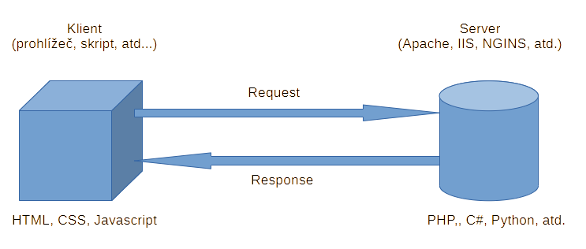

# HTTP protokol # 

## Dotaz (Request) ##

### GET ###
<pre style="white-space: pre; overflow-x: auto;"><code>
GET /lode/ HTTP/1.1
Accept: text/html,application/xhtml+xml,application/xml;q=0.9,image/avif,image/webp,image/apng,*/*;q=0.8,application/signed-exchange;v=b3;q=0.7
Accept-Encoding: gzip, deflate, br, zstd
Accept-Language: cs-CZ,cs;q=0.9
Connection: keep-alive
Cookie: pma_lang=cs; pmaUser-1=FtBvSQyQMaobmYW6JnwTF%2BEcBzbrbRfxJhYIcCYzbyDMAgJeyb62glIgiVE%3D; PHPSESSID=bc9hfgdblctuv0a3irbgs1vudv
Host: localhost
Referer: http://localhost/lode/
Sec-Fetch-Dest: document
Sec-Fetch-Mode: navigate
Sec-Fetch-Site: same-origin
Sec-Fetch-User: ?1
Upgrade-Insecure-Requests: 1
User-Agent: Mozilla/5.0 (Windows NT 10.0; Win64; x64) AppleWebKit/537.36 (KHTML, like Gecko) Chrome/142.0.0.0 Safari/537.36
sec-ch-ua: "Chromium";v="142", "Google Chrome";v="142", "Not_A Brand";v="99"
sec-ch-ua-mobile: ?0
sec-ch-ua-platform: "Windows"
</code></pre>

### POST ###  

<pre style="white-space: pre; overflow-x: auto;"><code>
POST /lode/index.php?type=user&action=login HTTP/1.1  
Accept: text/html,application/xhtml+xml,application/xml;q=0.9,image/avif,image/webp,image/apng,*/*;q=0.8,application/signed-exchange;v=b3;q=0.7  
Accept-Encoding: gzip, deflate, br, zstd  
Accept-Language: cs-CZ,cs;q=0.9  
Cache-Control: max-age=0
Connection: keep-alive
Content-Length: 45
Content-Type: application/x-www-form-urlencoded
Cookie: pma_lang=cs; pmaUser-1=FtBvSQyQMaobmYW6JnwTF%2BEcBzbrbRfxJhYIcCYzbyDMAgJeyb62glIgiVE%3D; PHPSESSID=cr5ufi9l50dvcveojn05l2930s
Host: localhost
Origin: http://localhost
Referer: http://localhost/lode/index.php?type=user&action=login
Sec-Fetch-Dest: document
Sec-Fetch-Mode: navigate
Sec-Fetch-Site: same-origin
Sec-Fetch-User: ?1
Upgrade-Insecure-Requests: 1
User-Agent: Mozilla/5.0 (Windows NT 10.0; Win64; x64) AppleWebKit/537.36 (KHTML, like Gecko) Chrome/142.0.0.0 Safari/537.36
sec-ch-ua: "Chromium";v="142", "Google Chrome";v="142", "Not_A Brand";v="99"
sec-ch-ua-mobile: ?0
sec-ch-ua-platform: "Windows"

name=uziv1&password=heslo&action=login-button
</code></pre>

## Odpověď (Response) ##
<pre style="white-space: pre; overflow-x: auto;"><code>
HTTP/1.1 200 OK
Date: Wed, 12 Nov 2025 07:54:11 GMT
Server: Apache/2.4.58 (Win64) OpenSSL/3.1.3 PHP/8.2.12
X-Powered-By: PHP/8.2.12
Expires: Thu, 19 Nov 1981 08:52:00 GMT
Cache-Control: no-store, no-cache, must-revalidate, max-age=0
Pragma: no-cache
Cache-Control: post-check=0, pre-check=0
Content-Length: 1181
Keep-Alive: timeout=5, max=100
Connection: Keep-Alive
Content-Type: text/html; charset=UTF-8

&lt;!DOCTYPE html&gt;
&lt;html&gt;
    ...
&lt;</html>&gt;
</code></pre>

### favicon.ico ###

<pre style="white-space: pre; overflow-x: auto;"><code>
HTTP/1.1 200 OK
Date: Wed, 12 Nov 2025 08:33:46 GMT
Server: Apache/2.4.58 (Win64) OpenSSL/3.1.3 PHP/8.2.12
Last-Modified: Tue, 11 Nov 2025 19:11:49 GMT
ETag: "6b94-643566b747010"
Accept-Ranges: bytes
Content-Length: 27540
Keep-Alive: timeout=5, max=99
Connection: Keep-Alive
Content-Type: image/x-icon

data:image/x-icon;base64,AAABAAYAOTkAAAEAIAC7NAAAZgAAAD ...
</code></pre>

